<div id="top"></div>

<div style="text-align:center">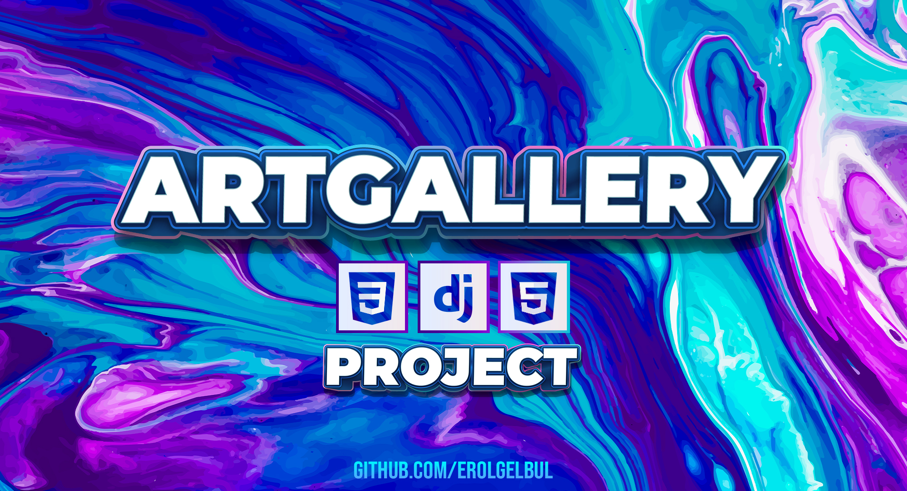</div>

## 1. Introduction

ArtGallery is a social media platform where artists come together to show their
personal/AI-generated/digital works.


### 1.1 Overview

<p align="center">
  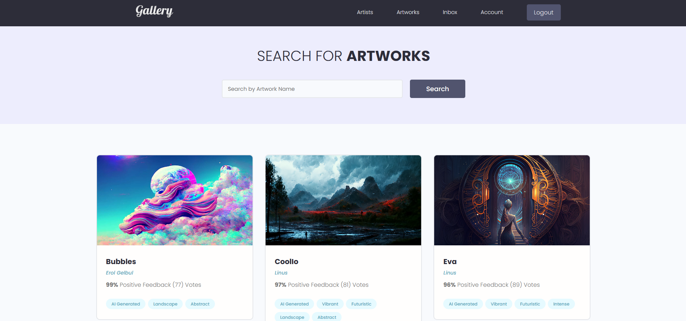
</p>

<ins>Back-end</ins>: Django, DRF
<ins>Front-end</ins>: HTML, CSS

---


#### 1.1.1 Image Licenses

The images used in this project are produced through my personal Midjourney subscription. The
images are not for sale nor I am monetizing these pictures in any way. The
project files do <ins>NOT</ins> include the images.

Some images are from [pixabay](https://pixabay.com/). None of the images are for
sale or used commercially. I hold the license for personal use.


#### 1.1.2 UI Kit

I do not own the UI kit. You can find it here: [Mumble UI Kit](https://github.com/divanov11/Mumble/blob/master/STYLE_GUIDE.md).

---

### 1.2 Getting Started

#### 1.2.1 Install Python

<ins>Windows</ins> 

1. Go to the official Python website:
[Python](https://www.python.org/downloads/windows/)
2. Download the latest version of Python for Windows by clicking on the
   "Download Python" button. Choose the version that is appropriate for your
   system (32-bit or 64-bit).
3. Open the downloaded installer and follow the installation wizard. Make sure
   to select the option "Add Python to PATH" during the installation process.

<ins>MacOS</ins> 

1. Go to the official Python website:
[Python](https://www.python.org/downloads/windows/)
2. Download the latest version of Python for Windows by clicking on the
   "Download Python" button. Choose the version that is appropriate for your
   system (32-bit or 64-bit).
3. Open the downloaded installer and follow the installation wizard. Make sure
   to select the option "Install for all users" and "Add Python to PATH" during
   the installation process.

<ins>Linux</ins> 

1. Open a terminal window.
2. Use the package manager for your Linux distribution to install Python. For
   example, on Ubuntu and Debian, you can use the command `sudo apt-get install
   python3` to install Python 3.
3. Verify that Python is installed by running the command `python3 --version` in
   the terminal. If Python is installed correctly, you should see the version
   number of Python that you installed.


#### 1.2.2 Install & Activate Virtual Environment

Depending on how you want to use this project, you may want to run it locally on
your machine. If so follow the steps on this section:

1. Install virtualenv: Once you have installed Python, you can install virtualenv using pip. Open your
terminal (Command Prompt for Windows) and type:
```bash
pip install virtualenv
```

<ins>MacOS & Linux</ins>

2. Create a virtual environment: To create a virtual environment, go to the
directory where you want to create it and run the following command:

```bash
virtualenv myenv
```
Here, myenv is the name of the virtual environment. You can choose any name you
want.

3. Activate the virtual environment: To activate the virtual environment,
run the following command:

```bash
source myenv/bin/activate
```

<ins>Windows</ins>

On Windows, the command is slightly different:

```bash
myenv\Scripts\activate.bat
```

#### 1.2.3 Install Requirements

1. Open the command prompt
2. Navigate to the directory that contains the requirements.txt file.
3. Run the following command:


```bash
pip install -r requirements.txt
```

## 1.2.4 Run on Local Server

Run inside the directory containing `manage.py` file:

```bash
python manage.py runserver
```

## 1.2.5 Run the migrations

Prepare:

```bash
python manage.py makemigrations
```

Run:

```bash
python manage.py migrate
```

<p align="right">(<a href="#top">back to top</a>)</p>


### 1.3 Database Design

<p align="center">
  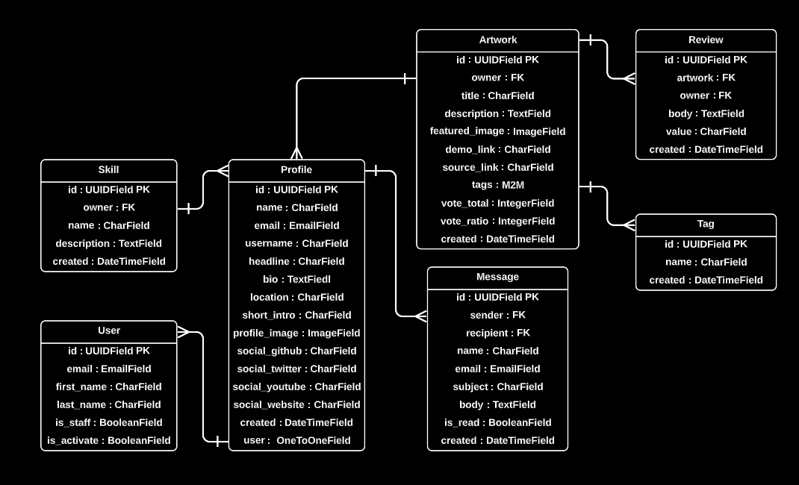
</p>


### 1.4 Models


#### 1.4.1 Profile Model

| Field            | Parameters                                    | Type          |
|------------------|-----------------------------------------------|---------------|
| user             | on_delete=models.CASCADE, null=True, blank=True | OneToOneField |
| name             | max_length=200, blank=True, null=True         | CharField     |
| email            | max_length=500, blank=True, null=True         | EmailField    |
| username         | max_length=200, blank=True, null=True         | CharField     |
| location         | max_length=200, blank=True, null=True         | CharField     |
| short_intro      | max_length=200, blank=True, null=True         | CharField     |
| bio              | blank=True, null=True                         | TextField     |
| profile_image    | null=True, blank=True, upload_to="profiles/", default="profiles/user-default.png" | ImageField |
| social_portfolio | max_length=200, blank=True, null=True         | CharField     |
| social_twitter   | max_length=200, blank=True, null=True         | CharField     |
| social_linkedin  | max_length=200, blank=True, null=True         | CharField     |
| social_website   | max_length=200, blank=True, null=True         | CharField     |
| created          | auto_now_add=True                             | DateTimeField |
| id               | default=uuid.uuid4, unique=True, primary_key=True, editable=False | UUIDField |

---
 
#### 1.4.2 Skill Model

| Field       | Parameters                                    | Type          |
|-------------|-----------------------------------------------|---------------|
| owner       | on_delete=models.CASCADE, null=True, blank=True | ForeignKey    |
| name        | max_length=200, blank=True, null=True         | CharField     |
| description | blank=True, null=True                         | TextField     |
| created     | auto_now_add=True                             | DateTimeField |
| id          | default=uuid.uuid4, unique=True, primary_key=True, editable=False | UUIDField |

---
 
#### 1.4.3 Message Model

| Field      | Parameters                                           | Type          |
|------------|------------------------------------------------------|---------------|
| sender     | on_delete=models.SET_NULL, null=True, blank=True      | ForeignKey    |
| recipient  | on_delete=models.SET_NULL, null=True, blank=True, related_name="messages" | ForeignKey |
| name       | max_length=200, null=True, blank=True                | CharField     |
| email      | max_length=200, null=True, blank=True                | EmailField    |
| subject    | max_length=200, null=True, blank=True                | CharField     |
| body       |                                                      | TextField     |
| is_read    | default=False, null=True                             | BooleanField  |
| created    | auto_now_add=True                                    | DateTimeField |
| id         | default=uuid.uuid4, unique=True, primary_key=True, editable=False | UUIDField |

---

#### 1.4.4 Artwork Model

| Field          | Parameters                                     | Type            |
|----------------|------------------------------------------------|-----------------|
| owner          | on_delete=models.SET_NULL, null=True, blank=True | ForeignKey      |
| title          | max_length=200                                 | CharField       |
| description    | null=True, blank=True                          | TextField       |
| featured_image | null=True, blank=True, default="default.jpg"    | ImageField      |
| demo_link      | max_length=2000, null=True, blank=True          | CharField       |
| source_link    | max_length=2000, null=True, blank=True          | CharField       |
| tags           | blank=True                                     | ManyToManyField |
| vote_total     | default=0, null=True, blank=True                | IntegerField    |
| vote_ratio     | default=0, null=True, blank=True                | IntegerField    |
| created        | auto_now_add=True                              | DateTimeField   |
| id             | default=uuid.uuid4, unique=True, primary_key=True, editable=False | UUIDField |


---

#### 1.4.5 Review Model

| Field    | Parameters                           | Type         |
|----------|--------------------------------------|--------------|
| owner    | on_delete=models.CASCADE, null=True  | ForeignKey   |
| artwork  | on_delete=models.CASCADE             | ForeignKey   |
| body     | null=True, blank=True                | TextField    |
| value    | max_length=200, choices=VOTE_TYPE     | CharField    |
| created  | auto_now_add=True                    | DateTimeField|
| id       | default=uuid.uuid4, unique=True, primary_key=True, editable=False | UUIDField |


---

#### 1.4.6 Tag Model

| Field   | Parameters             | Type          |
|---------|------------------------|--------------|
| name    | max_length=200         | CharField    |
| created | auto_now_add=True      | DateTimeField|
| id      | default=uuid.uuid4, unique=True, primary_key=True, editable=False | UUIDField |


---


### 1.5 Structure

<p align="center">
  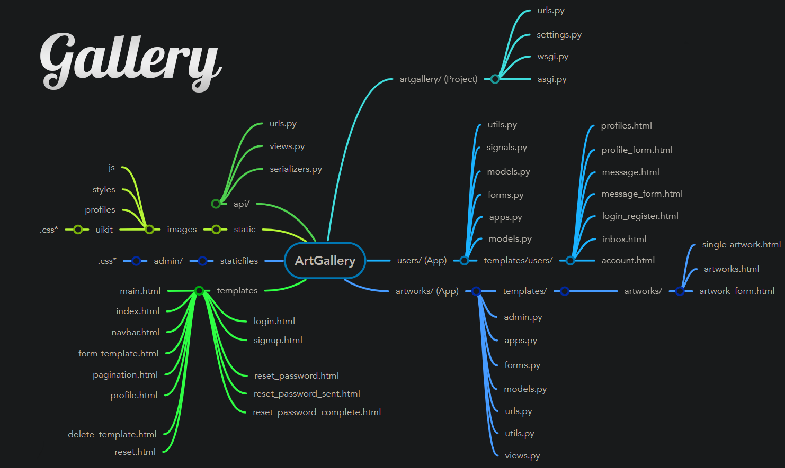
</p>


Created with [MindMeister](https://www.mindmeister.com).

---

## 2. Features

### 2.1 Registration & Authentication

If no user is logged in, the "Inbox" and "Account" feature will not be
available. This is achieved by using the @login_required decorator to enforce
authentication and authorization.

<p align="center">
  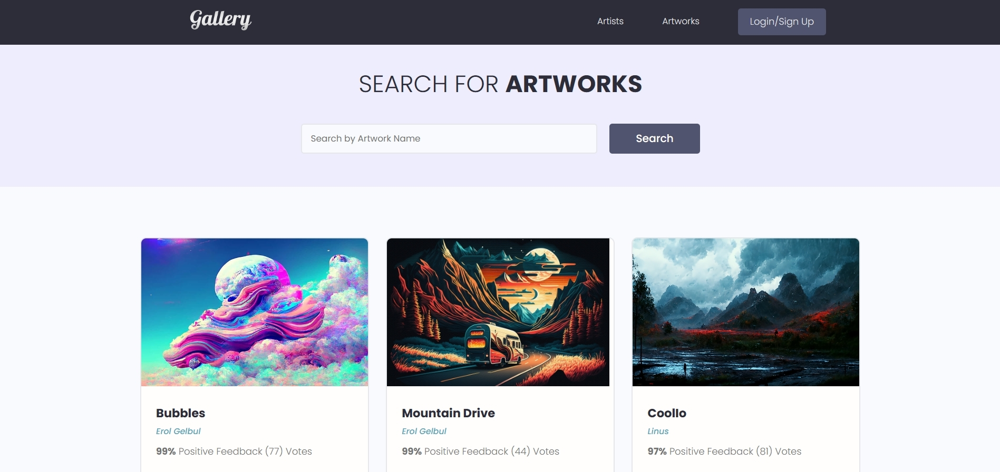
</p>

If an unauthenticated user tries to access the view, they will be redirected to
the login page specified in the login_url argument.

```python
@login_required(login_url="login")
def inbox(request):
    profile = request.user.profile
    message_requests = profile.messages.all()
    unread_count = message_requests.filter(is_read=False).count()
    context = {"message_requests": message_requests, "unread_count": unread_count}
    return render(request, "users/inbox.html", context)
```

### Registration:

<p align="center">
  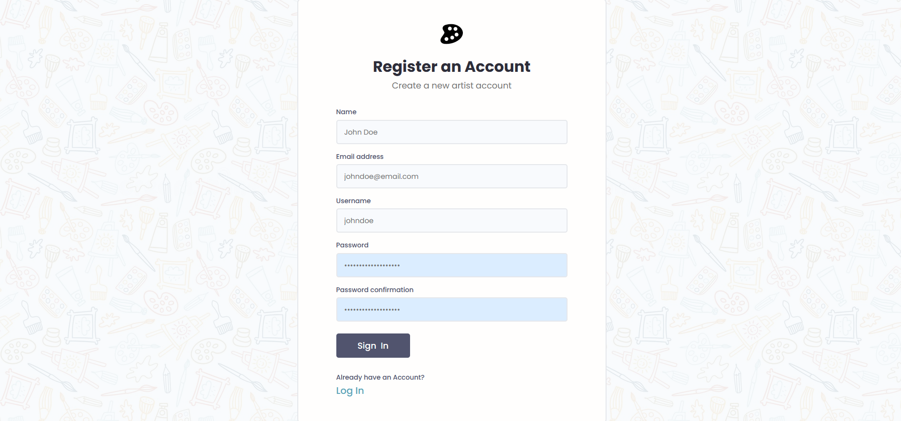
</p>

I used the built-in Django user creation form.
- It takes care of a lot of things, such as password hashing.
Whenever a user is trying register, it form is kept in a variable called `user`.
This form is then checked to see if the username is all lower case, so that the
app will not have multiple users with the same name but with different cases.
This temporary instance saving is done by form.save(commit=False)


### User Capabilities:
If the user is logged out, they see a different profile page compared to a
logged in user. If the user who is logged in is viewing their own profile page,
they get to edit their profile.


After registering you will receive your confirmation email:

<p align="center">
  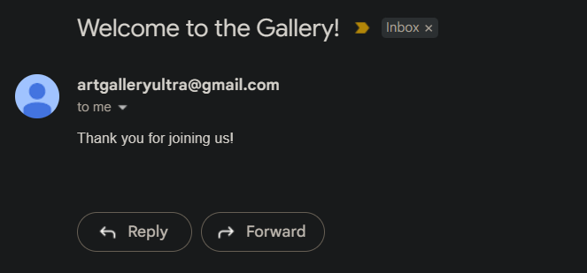
</p>

Set up the e-mail configurations inside the settings.py file:

```python
EMAIL_BACKEND = "django.core.mail.backends.smtp.EmailBackend"
EMAIL_HOST = # smtp of your e-mail provider.
EMAIL_PORT = 
EMAIL_USE_TLS = True
EMAIL_HOST_USER = # e-mail address
EMAIL_HOST_PASSWORD = # e-mail password
```

After registering the user will directly go to a page to setup their account.


### Authentication:
- If a user logs in, a session is created and they get redirected to the previous page they were on. 
- If a user logs out, the session is destroyed and they redirected to the home page.
- In each case depending on their authorisations, they get restrictions, For instance, if the user logs in, they will not be allowed to get into the login page.
- If a user is logged out, they won't be allowed to see the "Add Project" button. Moreover, they will not be allowed to go to `updateArtwork`, `createArtwork`, deleteArtwork pages.
  
The project does not use session based authentication, instead it uses [JSON Web Tokens](https://jwt.io/).


---

### 2.2 User Profile

<p align="center">
  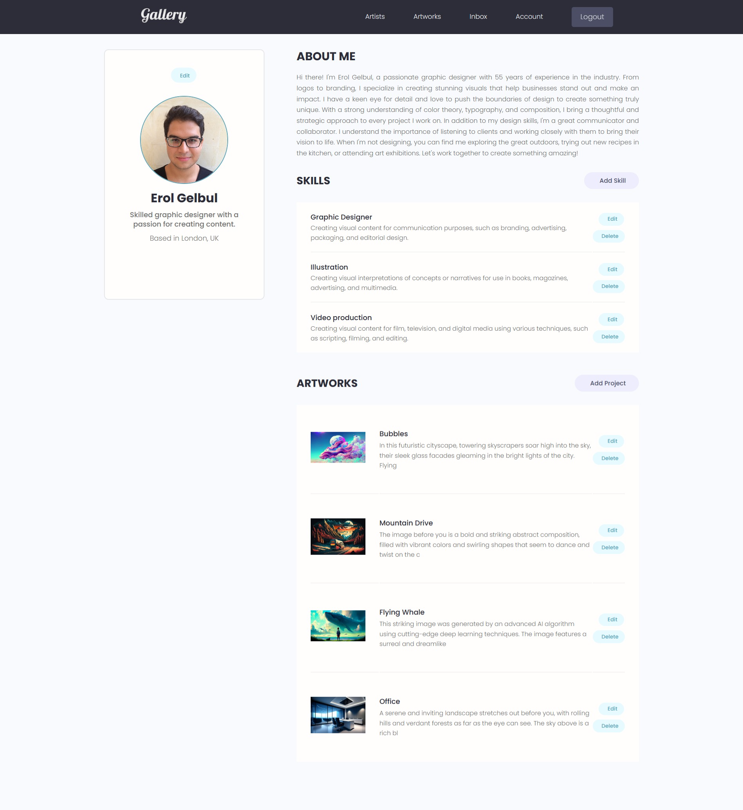
</p>

---

### 2.3 Search & Pagination

<p align="center">
  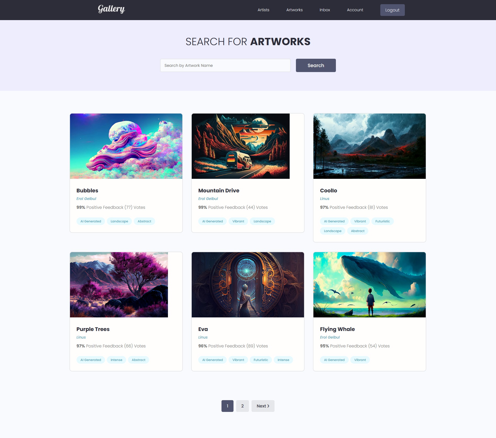
</p>

Pagination is available on multiple pages:
- Artists page
- Artworks page

---

### 2.4 Artwork Page

<p align="center">
  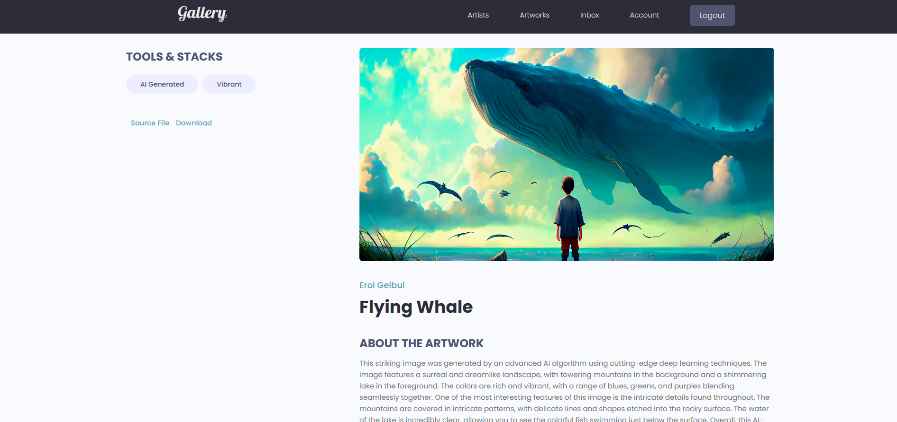
</p>

You can rate artworks. Every rating is then calculated using the
"get_vote_count" method:

```python
@property
def get_vote_count(self):
    reviews = self.review_set.all()
    up_votes = reviews.filter(value="up").count()
    total_votes = reviews.count()

    ratio = (up_votes / total_votes) * 100
    self.vote_total = total_votes
    self.vote_ratio = ratio

    self.save()
```

---

### 2.5 Artists' Page

<p align="center">
  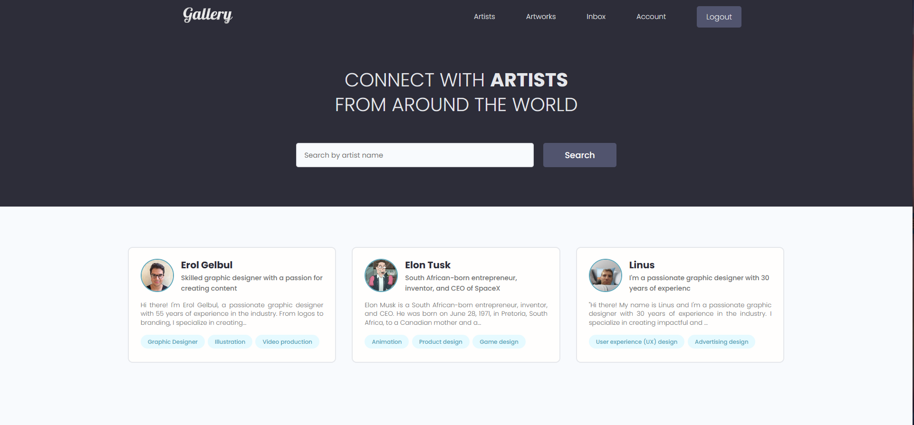
</p>


---

### 2.6 Messaging

<p align="center">
  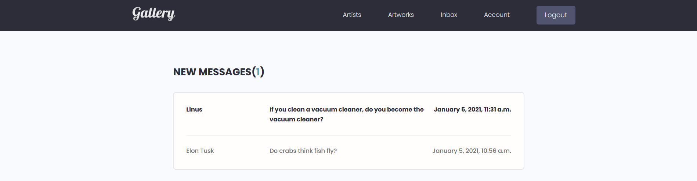
</p>

You can send and receive messages.

---

<p align="right">(<a href="#top">back to top</a>)</p>

## 3. Forms

I had an issue with form fields. I wanted to input a class in each form.
Although, my fields in the form were being looped dynamically so that it had no
code duplication. After researching, I found out that there are multiple ways of
doing this. You may want to use JavaScript and locate these fields using their
ID's  and then modify each field. Another option would be to customise the
models forms. Django's model forms are highly customisable, if you look through
Django GitHub repo. That is how I tackled that problem (inside form.py file, you
can overwrite the init method and go from there).


<p align="right">(<a href="#top">back to top</a>)</p>

## 4. Signals

Every time a user is created, a Profile also gets created because of the 1:1
relationship between these two models and Django executes this creation
automatically. This case should also occur the other way around and to do so,
signals are used. Inside of the Users app, models are followed by post_save and
post_delete methods to listen to the Profile. Each time a delete is called on
the Profile, the User will be deleted. This signal is mostly useful for keeping
consistency within admin actions. Since the users are only exposed to the
Profile model and not the User model.

Example:

```python
def updateUser(sender, instance, created, **kwargs):
    profile = instance
    user = profile.user

    if created is False:
        user.first_name = profile.name
        user.username = profile.username
        user.email = profile.email
        user.save()
```

<p align="right">(<a href="#top">back to top</a>)</p>

## 5. Flash Messages


I used Django documentation to create flash messages. These use sessions, they
are one time messages.

Use case examples: 
- Failed login attempt, where I used messages.error()
- Successful account registration, where I used messages.success()


<p align="right">(<a href="#top">back to top</a>)</p>

## 6. CRUD

Users can do CRUD operations. I used "_" in templates to specify that these
files are responsible for CRUD. Users can CRUD:
	- Skills
	- User information
	

<p align="right">(<a href="#top">back to top</a>)</p>

## 7. Final Notes

Aside from the character, text limitations; there are some limitations worth
mentioning in the system to prevent errors which were found during tests.

- The amount of distinct skills a user can display on the "Artists" page must be limited since the personal info block is extendable by design. Used 'profile.skill_set.all|slice:"5"' while looping through the tags.

JavaScript Use Cases:
	When I was building the paginator, it would not work coherently with search. Therefore, I used javascript to query both the page number and the searchquery together.  First I got the search form and the page links. Then I used the event handler to pass these links at the click event.

<p align="right">(<a href="#top">back to top</a>)</p>

## 6. Future Work

- Deployment.

<p align="right">(<a href="#top">back to top</a>)</p>

## 7. Contributing

If you would like to add any extra features to the optimisation simulation, feel free to fork and create a pull request. Thank you!

1. Fork the Project
2. Create your Feature Branch (`git checkout -b feature/AmazingFeature`)
3. Commit your Changes (`git commit -m 'Add some AmazingFeature'`)
4. Push to the Branch (`git push origin feature/AmazingFeature`)
5. Open a Pull Request

<p align="right">(<a href="#top">back to top</a>)</p>


<!-- CONTACT -->
## 8. Contact

Erol Gelbul - [Website](http://www.erolgelbul.com)

Project Link: [ArtGallery](https://github.com/ErolGelbul/artgallery)

<p align="right">(<a href="#top">back to top</a>)</p>


